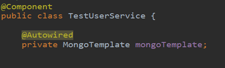

# MongoDB快速上手攻略


## 1.	MongoDB 概述

### 1.1	简介

​	MongoDB是一个高性能，开源，无模式的，基于分布式文件存储的文档型数据库，由C++语言编写，是一种开源的文档数据库──NoSql数据库的一种。NoSql，全称是 Not Only Sql,指的是非关系型的数据库。是一个介于关系数据库和非关系数据库之间的产品，是非关系数据库当中功能最丰富，最像关系数据库的。他支持的数据结构非常松散，是类似 json的bjson格式，因此可以存储比较复杂的数据类型。Mongo最大的特点是他支持的查询语言非常强大，其语法有点类似于面向对象的查询语言，几 乎可以实现类似关系数据库单表查询的绝大部分功能，而且还支持对数据建立索引。

### 1.2	同级产品

[CouchDB](http://www.oschina.net/p/couchdb)

​	Apache CouchDB 是一个面向文档的数据库管理系统。它提供以 JSON 作为数据格式的 REST 接口来对其进行操作，并可以通过视图来操纵文档的组织和呈现。 CouchDB 是 Apache 基金会的顶级开源项目。

[Terrastore](http://www.oschina.net/p/terrastore)

​	Terrastore是一个基于[Terracotta](http://www.oschina.net/p/terracotta)（一 个业界公认的、快速的分布式集群组件）实现的高性能分布式文档数据库。可以动态从运行中的集群添 加/删除节点，而且不需要停机和修改任何配置。支持通过http协议访问Terrastore。Terrastore提供了一个基于集合的键/值接口来管 理JSON文档并且不需要预先定义JSON文档的架构。易于操作，安装一个完整能够运行的集群只需几行命令。

[ThruDB](http://www.oschina.net/p/thrudb)

​	Thrudb是一套简单的服务建立在Apache的[Thrift](http://www.oschina.net/p/thrift)的框架，提供索引和文件存储服务的网站建设和推广。其目的是提供Web开发灵活，快速和易于使用的服务，可以加强或取代传统的数据存储和访问层。

### 1.3	同质分析

​	Mongo最大的特点是他支持的查询语言非常强大，其语法有点类似于面向对象的查询语言，几乎可以实现类似关系数据库单表查询的绝大部分功能，而且还支持对数据建立索引。所谓“面向集合”（Collenction-Orented），意思是数据被分组存储在数据集中，被称为一个集合（Collenction)。每个 集合在数据库中都有一个唯一的标识名，并且可以包含无限数目的文档。集合的概念类似关系型数据库（RDBMS）里的表（table），不同的是它不需要定义任何模式（schema)。模式自由（schema-free)，意味着对于存储在mongodb数据库中的文件，我们不需要知道它的任何结构定义。如果需要的话，你完全可以把不同结构的文件存储在同一个数据库里。存储在集合中的文档，被存储为键-值对的形式。键用于唯一标识一个文档，为字符串类型，而值则可以是各中复杂的文件类型。我们称这种存储形式为BSON（Binary Serialized dOcument Format）。


## 2.	优越性

### 2.1	特点：

MongoDB数据库的特点是高性能、易部署、易使用，存储数据非常方便。主要功能特性有：

面向集合存储，易存储对象类型的数据。

   1. 模式自由。
   2. 支持动态查询。
   3. 支持完全索引，包含内部对象。
   4. 支持查询。
   5. 支持复制和故障恢复。

面向文档存储(类JSON数据模式简单而强大)
   1. 使用高效的二进制数据存储，包括大型对象（如视频等）。
   2. 自动处理碎片，以支持云计算层次的扩展性
   3. 支持RUBY，PYTHON，JAVA，C++，PHP等多种语言。
   4. 文件存储格式为BSON（一种JSON的扩展）
   5. 可通过网络访问 

MongoDB是一个开源的NoSQL文档数据库，它使用一个JSON格式的模式（schema）替换了传统的基于表的关系数据。

### 2.2	使用场景

**更高的写入负载**

​	默认情况下，MongoDB更侧重高数据写入性能，而非事务安全，MongoDB很适合业务系统中有大量“低价值”数据的场景。但是应当避免在高事务安全性的系统中使用MongoDB，除非能从架构设计上保证事务安全。

**数据量很大或者未来会变得很大**

​	依赖数据库(MySQL)自身的特性，完成数据的扩展是较困难的事，在MySQL中，当一个单达表到5-10GB时会出现明显的性能降级，此时需要通过数据的水平和垂直拆分、库的拆分完成扩展，使用MySQL通常需要借助驱动层或代理层完成这类需求。而MongoDB内建了多种数据分片的特性，可以很好的适应大数据量的需求。

**结构不明确，且数据在不断变大**

​	在一些传统RDBMS（关系数据库管理系统）中，增加一个字段会锁住整个数据库/表，或者在执行一个重负载的请求时会明显造成其它请求的性能降级。通常发生在数据表大于1G的时候（当大于1TB时更甚）。 因MongoDB是文档型数据库，为非结构货的文档增加一个新字段是很快速的操作，并且不会影响到已有数据。另外一个好处当业务数据发生变化时，是将不在需要由DBA（数据库管理员）修改表结构。


## 3.	环境配置

### 3.1.	工具和基本资源下载：

 

官方资料：

​	MongoDB官方安装环境          <https://www.mongodb.com/download-center?jmp=nav#community>

​	rodo3t可视化工具                  <https://mac.softpedia.com/get/Developer-Tools/Robomongo.shtml>

懒人模式(百度网盘)：

​	链接：https://pan.baidu.com/s/1-5ac5-y1gpaMLeLj0yT3Pg 密码：p79b（绿色版免安装）

### 3.2	环境搭建

### 安装版

​	官网下载完成后双击打开 ，点击Next进行下一步 

​	 

​	选择自定义安装 Custom

​	 		 	

​	设置账号密码，和data ,log 目录位置

​	 		 	

​	

### 绿色版

​	百度网盘下载完成后目录结构：

​	bin 目录存放执行文件 

​        start.bat启动脚本 与绿色版不同的是需要手动创建log目录和data目录

​        start.bat启动脚本（注：需要放到与bin同级目录下，或者修改该文件中的bin\mongod.exe	

​	 

##### 解释	start.bat：

start.bat文件中  bin\mongodb.exe 启动mongodb

​          -dur 数据目录 & 日志目录  

​          --dbpath 数据目录 , 需要自己创建data目录。

​          --logpath 日志目录 , 需要自己创建logs目录。

​          --logappend 日志追加模式

##### 完整目录创建如下：

绿色版安装完成

### robo3t使用：

​	点击robo3t.exe :

​	 

​	首次运行需要 点击 Create 创建一个连接 

​	 

​	设置连接名，和端口。点击Save 

​	 

​	点击进入 

​	  

​	页面显示结果 

​	 

## 4. 	基本使用

### 4.1	Java代码连接数据库

#### 1. 	创建maven项目，导入mongodb所需坐标

```java
    <dependency>
                <groupId>org.mongodb</groupId>
                <artifactId>mongo-java-driver</artifactId>
                <version>3.8.1</version>
    </dependency>

```


#### 2.    通过Java的代码获得连接

```java
public static void main( String args[] ){
    try{
        // 连接到 mongodb 服务 参数1：ip地址，参数2：端口号
        MongoClient mongoClient = new MongoClient( "localhost" , 27017 );
        // 连接到数据库 参数：数据库名 
        MongoDatabase mongoDatabase = mongoClient.getDatabase("mycol")；
    }catch(Exception e){
        System.err.println( e.getClass().getName() + ": " + e.getMessage() );
    }
}

```

### 4.2   普通的增删改查

#### **4.2.1** 添加

```java
public static void main( String args[] ){
        try{
            // 连接到 mongodb 服务
            MongoClient mongoClient = new MongoClient( "localhost" , 27017 );
            // 连接到数据库
            MongoDatabase mongoDatabase = mongoClient.getDatabase("mycol");
            //创建文档
            MongoCollection<Document> collection = mongoDatabase.getCollection("user");
            //准备数据
            Document document = new Document("name", "gdj").
                    append("sex", "男").
                    append("age", 18).
                    append("phone", "17633923693");
            List<Document> documents = new ArrayList<Document>();
            documents.add(document);
            //将数据存入数据库
            collection.insertMany(documents);
            }catch(Exception e){
        System.err.println( e.getClass().getName() + ": " + e.getMessage() );
    }
}	

```

数据库效果展示

 

注：id自动生成

#### **4.2.2** 删除

```java
//删除age为18的第一个文档  
collection.deleteOne(Filters.eq("age", 18));  
//删除age为18 所有文档  
collection.deleteMany (Filters.eq("age", 18));

```

#### **4.2.3** **修改**

```java
//更新文档 将文档中 所有age=18的文档修改为 age=20  
collection.updateMany(Filters.eq("age", 18), new Document("$set",new Document("age",20)));

```

**数据库效果**  

   

#### **4.2.4** **查询所有**

```java
public static void main( String args[] ){
    try{
        // 连接到 mongodb 服务
        MongoClient mongoClient = new MongoClient( "localhost" , 27017 );
        // 连接到数据库
        MongoDatabase mongoDatabase = mongoClient.getDatabase("mycol");
        //创建文档
        MongoCollection<Document> collection = mongoDatabase.getCollection("user");
        //查询所有
        FindIterable<Document> findIterable = collection.find();
        MongoCursor<Document> mongoCursor = findIterable.iterator();
        while(mongoCursor.hasNext()){
            System.out.println(mongoCursor.next());
        }
    }catch(Exception e){
        System.err.println( e.getClass().getName() + ": " + e.getMessage() );
    }
}

```

**控制台效果**

   


#### 4.2.5 条件查询

```java
//设置查询条件
//DBObject dbobject = new BasicDBObject();
//dbobject.put("age", 18);
//将查询条件放入返回结果集
//DBCursor dbCursor = dbcollection.find(dbobject);
//无查询条件 返回所有结果集
DBCursor dbCursor = dbcollection.find(null);

```


### 4.3 设置密码&关闭资源& MongoDB读出的数据JavaBe结合

#### 4.3.1 设置密码

```java
public static void main(String[] args){  
        try {  
            //连接到MongoDB服务 如果是远程连接可以替换“localhost”为服务器所在IP地址  
            //ServerAddress()两个参数分别为 服务器地址 和 端口  
            ServerAddress serverAddress = new ServerAddress("localhost",27017);  
            List<ServerAddress> addrs = new ArrayList<ServerAddress>();  
            addrs.add(serverAddress);  
              
            //MongoCredential.createScramSha1Credential()三个参数分别为 用户名 数据库名称 密码 
            MongoCredential credential = MongoCredential.createScramSha1Credential("username", "databaseName", "password".toCharArray());  
            List<MongoCredential> credentials = new ArrayList<MongoCredential>();  
            credentials.add(credential);  
              
            //通过连接认证获取MongoDB连接  
            MongoClient mongoClient = new MongoClient(addrs,credentials);  
            //连接到数据库  
            MongoDatabase mongoDatabase = mongoClient.getDatabase("databaseName");  
           
        } catch (Exception e) {  
            System.err.println( e.getClass().getName() + ": " + e.getMessage() );  
        }  
    }  

```

#### 4.3.2 关闭资源

```java
mongoClient.close();
```


#### 4.3.3  MongoDB读出的数据 与 JavaBean完美结合

##### 1. **自定义工具**

```java
package com.czxy.utils;
import com.google.gson.Gson;
import com.mongodb.DBObject;
import com.mongodb.util.JSON;
import java.beans.BeanInfo;
import java.beans.Introspector;
import java.beans.PropertyDescriptor;
import java.util.Map;
/**
* @author 郭德峻
* @create 2018/9/1 0:26
* @mailbox 1608986484@qq.com
* @desc
**/
public class DBObjectToJavaBean {
    /**
     * @author 郭德峻
     * @create 2018/9/1 10:36
     * @SuppressWarnings 用于抑制编译器产生警告信息。
     * @desc 方法描述 ：此方法用于将 Map数据转换成JavaBean
     **/
    @SuppressWarnings("rawtypes")
    public static Object convertMap(Class type, Map map) throws Exception {
        //获取类属性
        BeanInfo beanInfo = Introspector.getBeanInfo(type);
        // 创建 JavaBean 对象
        Object obj = type.newInstance();
        // 给 JavaBean 对象的属性赋值
        PropertyDescriptor[] propertyDescriptors = beanInfo.getPropertyDescriptors();
        for (int i = 0; i < propertyDescriptors.length; i++) {
            PropertyDescriptor descriptor = propertyDescriptors;
            String propertyName = descriptor.getName();
            if (map.containsKey(propertyName)) {
                //当一个属性赋值失败的时候就不会影响其他属性赋值。
                try {
                    Object value = map.get(propertyName);
                    Object[] args = new Object[1];
                    args[0] = value;
                    descriptor.getWriteMethod().invoke(obj, args);
                } catch (Exception e) {
                }
            }
        }
        return obj;
    }
    /**
     * @author  郭德峻
     * @create  2018/9/1 10:47
     * @desc    方法描述 ：此方法用于将 JavaBean 数据转换成 DBObject便于MongoDB存储数据
     *
     **/
    public static DBObject beanToDBObject(Object obj) {
        Gson gson = new Gson();
        DBObject dbObject = (DBObject) JSON.parse(gson.toJson(obj));
        gson = null;
        return dbObject;
    }
}

```

##### 2. **将**JavaBean对象存入MongoDB

```java
package com.czxy.gdj;

import com.czxy.domain.User;
import com.czxy.utils.DBObjectToJavaBean;
import com.mongodb.*;
import org.junit.Test;
import java.util.Map;
/**
* @author 郭德峻
* @create 2018/9/1 9:59
* @mailbox 1608986484@qq.com
* @desc
**/
public class FlagMongodb {
    /**
     * @author  郭德峻
     * @create  2018/9/1 10:48
     * @desc    向 MongoDb 数据库中 添加 JavaBean 数据
     *
     **/
    @Test
    public void TestMongoDbAdd() throws Exception {
        // 建立起一个连接
        Mongo mongo = new Mongo("localhost", 27017);
        // 获取到指定的数据库
        DB db = mongo.getDB("mycol");
        DBCollection dbcollection = db.getCollection("user");
        //获得JavaBean对象， 将其转换成DBObject对象
        //1.获得JavaBean对象
        User user = new User();
        user.setName("gll123456789");
        user.setAge(50);
        
        //调用自定义 工具 将 JavaBean 数据转换成 DBObject
        DBObject dbObject = DBObjectToJavaBean.beanToDBObject(user);
        //插入数据库
        dbcollection.insert(dbObject);
        //关闭资源
        mongo.close();
    }
}

```

##### 3.     将MongoDB 中的数据JavaBean的形式取出

```java
package com.czxy.gdj;

import com.czxy.domain.User;
import com.czxy.utils.DBObjectToJavaBean;
import com.mongodb.*;
import org.junit.Test;
import java.util.Map;

/**
* @author 郭德峻
* @create 2018/9/1 9:59
* @mailbox 1608986484@qq.com
* @desc
**/
public class FlagMongodb {

    /**
     * @author  郭德峻
     * @create  2018/9/1 10:48
     * @desc    将 MongoDb 数据库中的数据 变成 JavaBean
     *
     **/
    @Test
    public void TestMongoDbFindAll() throws Exception {
        // 建立起一个连接
        Mongo mongo = new Mongo("localhost", 27017);
        // 获取到指定的数据库
        DB db = mongo.getDB("mycol");
        DBCollection dbcollection = db.getCollection("user");
        //设置查询条件
        //DBObject dbobject = new BasicDBObject();
        //dbobject.put("age", 18);
        //将查询条件放入返回结果集
        //DBCursor dbCursor = dbcollection.find(dbobject);
        //无查询条件 返回所有结果集
        DBCursor dbCursor = dbcollection.find(null);
        // 遍历获取结果集
        while (dbCursor.hasNext()) {
            DBObject dbo = dbCursor.next();
            //将DBObject转换成Map,为将数据转成javaBean做准备
            Map map = dbo.toMap();
            //调用自定义 工具 将 map 数据转换成 javaBean
            User user = (User) DBObjectToJavaBean.convertMap(User.class,map);
            System.out.println(user);
        }
    }
}

```

## 5.	进阶使用

### 5.1整合SpringBoot

#### 创建项目

点击

File	》Project   

   

##### 或者Create New Project

#####    

##### 选择Spring Initilizr 

#####    

##### 设置项目名

#####     

##### 选择数据库NoSQL 勾选MongDB

 


##### 设置存储路径 

 

注：mongoDb所需jar包idea已经配好

##### 配置文件

​	配置文件中的mycol与数据库一一对应

​	如果有密码需要一起配置 name（用户名）：pass（密码） 

 


#### 编写Cntroller并引入Service

####   

#### 编写Service并引入MongoTemplate内置对象 

 


#### 编写Mapper（可以不要）

 

MongoRepository只提供了 增删查功能，功能不全

#### 编写domain

 

Document(collection=”数据库文档名”)

 


#### 实现增删改查（ Restful  +  SpringBoot）

​	没有mapper层,通过MongoTemplate内置对象直接进行操作

##### 增加

###### Cotroller

```java
/**
 * @author 郭德峻
 * @create 2018/9/5 10:55
 * @desc 添加用户
 **/
@PostMapping
public ResponseEntity<Void> addStandard(User user) {
    try {
        testUserService.save(user);
        return new ResponseEntity<>(HttpStatus.CREATED);
    } catch (Exception e) {
        e.printStackTrace();
        return new ResponseEntity<>(HttpStatus.INTERNAL_SERVER_ERROR);
    }
}

```

###### Service

```java
public void save(User user) {
    mongoTemplate.save(user);
}

```

##### 根据条件删除

###### Cotroller

```java
/**
  * @author 郭德峻
  * @create 2018/9/5 10:55
  * @desc 删除用户
  **/
@DeleteMapping("/{id}")
 public ResponseEntity<Void> deleteUser(@PathVariable("id") String id) {
     try {
         testUserService.deleteUserById(id);
         return new ResponseEntity<>(HttpStatus.CREATED);
     } catch (Exception e) {
         e.printStackTrace();
         return new ResponseEntity<>(HttpStatus.INTERNAL_SERVER_ERROR);
     }
 }

```

###### Service

```java
/**
  * @author 郭德峻
  * @create 2018/9/5 10:55
  * @desc 删除用户
  **/
@DeleteMapping("/{id}")
 public ResponseEntity<Void> deleteUser(@PathVariable("id") String id) {
     try {
         testUserService.deleteUserById(id);
         return new ResponseEntity<>(HttpStatus.CREATED);
     } catch (Exception e) {
         e.printStackTrace();
         return new ResponseEntity<>(HttpStatus.INTERNAL_SERVER_ERROR);
     }
 }

```

##### 条件查询

###### Cotroller

```java
/**
 * @author 郭德峻
 * @create 2018/9/5 10:56
 * @desc 条件查询
 **/
@GetMapping("/{id}")
public ResponseEntity<User> findByCondition(@PathVariable("id") String id) {
    try {
        User user = testUserService.findById(id);
        return new ResponseEntity<>(user, HttpStatus.OK);
    } catch (Exception e) {
        e.printStackTrace();
        return new ResponseEntity<>(HttpStatus.INTERNAL_SERVER_ERROR);
    }
}

```

###### Service

```java
/**
 * @author 郭德峻
 * @create 2018/9/7 8:27
 * @desc id查一个
 **/
public User findById(String id) {
    User user = mongoTemplate.findById(id, User.class);
    return user;
}

```

##### 查询所有

###### Cotroller

```java
/**
 * @author 郭德峻
 * @create 2018/9/5 10:55
 * @desc 查询所有用户
 **/
@GetMapping("/all")
public ResponseEntity<List<User>> findAll() {
    try {
        List<User> result = testUserService.findByCondition();
        return new ResponseEntity<>(result, HttpStatus.OK);
    } catch (Exception e) {
        e.printStackTrace();
        return new ResponseEntity<>(HttpStatus.INTERNAL_SERVER_ERROR);
    }
}

```

###### Service

```java
/**
 * @author 郭德峻
 * @create 2018/9/5 23:20
 * @desc 查询 多条 数据
 * 注：如果要进行分页 ， 页码在 mongodb 中是从0开始的。
 **/
public List<User> findByCondition() {
    List<User> list = mongoTemplate.findAll(User.class);
    return list;
}

```

##### 修改

###### Cotroller

```java
/**
 * @author 郭德峻
 * @create 2018/9/5 10:56
 * @desc 修改用户

 **/
@PutMapping
public ResponseEntity<Void> editUser(User user){
    try {
        testUserService.updateUser(user);
        return new ResponseEntity<>(HttpStatus.NO_CONTENT);
    } catch (Exception e) {
        e.printStackTrace();
        return new ResponseEntity<>(HttpStatus.INTERNAL_SERVER_ERROR);
    }
}
```

###### Service

```java
/**
 * 更新对象
 *
 * @param user
 */
public void updateUser(User user) {
    Query query = new Query(Criteria.where("id").is(user.getId()));
    /*调用UpdateUtils 数据拼接*/
    Update update = new Update();

    update.set("age",user.getAge());
    update.set("name",user.getName());
    update.set("sex",user.getSex());

    //更新查询返回结果集的第一条
    UpdateResult updateResult = mongoTemplate.updateFirst(query, update, User.class);
    System.err.println(updateResult);
}

```

​	需要将更新的数据一个一个进行拼接，但是如果javabean属性比较多，拼起来将非常麻烦，而且还要考虑每一个属性是否为null ，为此下面这个工具类将是你的不二之选

   


​	在我们的Service方法中只需要传递一个javaBean对象即可

```java
/**
 * 更新对象
 *
 * @param user
 */
public void updateUser(User user) {
    Query query = new Query(Criteria.where("id").is(user.getId()));
    /*调用UpdateUtils 数据拼接*/
    Update update = UpdateUtils(user);
    //更新查询返回结果集的第一条
    UpdateResult updateResult = mongoTemplate.updateFirst(query, update, User.class);
    System.err.println(updateResult);
}

```

## 6.	存在问题

### 6.1 	javaBean的时间属性

​	MongoDB中的时间类型默认是MongoDate，MongoDate默认是按照UTC（世界标准时间）来存储。

一个Date类型，一个是String类型。两条数据的时间相差大约8个小时（忽略操作时间），第一条数据MongoDB是按照UTC时间来进行存储。
 一般，我们在使用MongoDB存储时间的时候会把时间存储成字符串（或者直接存储为毫秒数），将MongoDB内置处理的这部分内容完全交由服务器来做，这样也能保证所有的时间格式统一、逻辑统一。

### 6.2 	MongoDb安全

MongoDB

​	在默认设置下并没有身份验证。MongoDB会认为自身处在一个拥有防火墙的信任网络。但是这不代表它不支持身份验证，如果需要可以轻松的开启（启动参数auth）。
 还有一点就是，与MongoDB的连接默认情况下都是非加密的，这就意味你的数据可能被第三方记录和使用。如果你的MongoDB是在自己的非广域网下使用，那么这种情况是不可能发生的。如果你希望你的数据不被他人记录和使用，需要

私人定制一个自己的

MongoDB。（条件你懂得）

## 7.性能的优化（来自百度）

### 7.1完全分离（范式化设计）

示例1：

````java
{
     "_id" : ObjectId("5124b5d86041c7dca81917"),
     "title" : "如何使用MongoDB", 
      "author" : [ 
               ObjectId("144b5d83041c7dca84416"),
              ObjectId("144b5d83041c7dca84418"),
              ObjectId("144b5d83041c7dca84420"),
     ]
 }    

````

​	我们将**作者(comment)** 的id数组作为一个字段添加到了**图书**中去。这样的设计方式是在非关系型数据库中常用的，也就是我们所说的范式化设计。在MongoDB中我们将与主键没有直接关系的图书单独提取到另一个集合，用存储主键的方式进行关联查询。当我们要查询文章和评论时需要先查询到所需的文章，再从文章中获取评论id，最后用获得的完整的文章及其评论。在这种情况下查询性能显然是不理想的。但当某位作者的信息需要修改时，范式化的**维护优势**就凸显出来了，我们无需考虑此作者关联的图书，直接进行修改此作者的字段即可。 

### 7.2完全内嵌（反范式化设计）

示例2：

```java
{
       "_id" : ObjectId("5124b5d86041c7dca81917"),
       "title" : "如何使用MongoDB",
       "author" : [
                {
                    　　　　 "name" : "丁磊"
                   　　　　  "age" : 40,
                     　　　　"nationality" : "china",
                },
                {
                   　　　　  "name" : "马云"
                  　　　　   "age" : 49,
                   　　　　  "nationality" : "china",
                },
                {
                   　　　　  "name" : "张召忠"
                  　　　　   "age" : 59,
                  　　　　   "nationality" : "china",
                },
      ]
  }   

```

​	在这个示例中我们将作者的字段完全嵌入到了图书中去，在查询的时候直接查询图书即可获得所对应作者的全部信息，但因一个作者可能有多本著作，当修改某位作者的信息时时，我们需要遍历所有图书以找到该作者，将其修改。

### 7.3部分内嵌（折中方案）

示例3：

````java
{
       "_id" : ObjectId("5124b5d86041c7dca81917"),
       "title" : "如何使用MongoDB",
       "author" : [ 
               {
                     　　　　"_id" : ObjectId("144b5d83041c7dca84416"),
                   　　　　  "name" : "丁磊"
                },
                {
                    　　　　 "_id" : ObjectId("144b5d83041c7dca84418"),
                  　　　　   "name" : "马云"
                },
                {
                    　　　　 "_id" : ObjectId("144b5d83041c7dca84420"),
                   　　　　  "name" : "张召忠"
                },
      ]
  }

````

​	这次我们将作者字段中的最常用的一部分提取出来。当我们只需要获得图书和作者名时，无需再次进入作者集合进行查询，仅在图书集合查询即可获得。

　　这种方式是一种相对折中的方式，既保证了查询效率，也保证的更新效率。但这样的方式显然要比前两种较难以掌握，难点在于需要与**实际业务**进行结合来寻找合适的提取字段。如同示例3所述，名字显然不是一个经常修改的字段，这样的字段如果提取出来是没问题的，但如果提取出来的字段是一个经常修改的字段（比如age）的话，我们依旧在更新这个字段时需要大范围的寻找并依此进行更新。

　　在上面三个示例中，第一个示例的更新效率是最高的，但查询效率是最低的，而第二个示例的查询效率最高，但更新效率最低。所以在实际的工作中我们需要根据自己实际的需要来设计表中的字段，以获得最高的效率。

### 7.4.索引越少越好

​	索引可以极大地提高查询性能，那么索引是不是越多越好？答案是否定的，并且索引并非越多越好，而是**越少越好**。每当你建立一个索引时，系统会为你添加一个索引表，用于索引指定的列，然而当你对已建立索引的列进行插入或修改时，数据库则需要对原来的索引表进行重新排序，重新排序的过程非常消耗性能，但应对少量的索引压力并不是很大，但如果索引的数量较多的话对于性能的影响可想而知。所以在创建索引时需要谨慎建立索引，要把每个索引的功能都要发挥到极致，也就是说**在可以满足索引需求的情况下，索引的数量越少越好**。

#### 一.  隐式索引

```java
//建立复合索引
db.test.ensureIndex({"age": 1,"no": 1,"name": 1 })

```

​	我们在查询时可以迅速的将age,no字段进行排序，隐式索引指的是**如果我们想要排序的字段包含在已建立的复合索引中则无需重复建立索引**。

```java
db.test.find().sort("age": 1,"no": 1)
db.test.find().sort("age": 1)

```

​	如以上两个排序查询，均可使用上面的复合索引，而不需要重新建立索引。 

#### 二.  翻转索引

```java
//建立复合索引
db.test.ensureIndex({"age": 1})

```

​	翻转索引很好理解，就是我们在排序查询时无需考虑索引列的方向，例如这个例子中我们在查询时可以将排序条件写为"{'age': 0}"，依旧不会影响性能。

2.索引列颗粒越小越好

　　什么叫颗粒越小越好？在索引列中每个数据的重复数量称为颗粒，也叫作索引的**基数**。如果数据的颗粒过大，索引就无法发挥该有的性能。例如，我们拥有一个"age"列索引，如果在"age"列中，20岁占了50%，如果现在要查询一个20岁，名叫"Tom"的人，我们则需要在表的50%的数据中查询，索引的作用大大降低。所以，我们在建立索引时要尽量将数据颗粒小的列放在索引左侧，以保证索引发挥最大的作用。

### 范式化模型

 范式化模型要求满足下面三大范式：

​	1.     每个字段只包含最小的信息属性。如果某个字段名称为name-age，value为zhangsan-23，则这个模型不满足第一范式，需要将name-age分为两个属性name和age后才满足第一范式。

​	2.     （在满足第一范式基础上）模型含有主键，非主键字段依赖主键。比如订单这个模型，它的主键是订单ID，那么订单模型其它字段都应该依赖于订单ID，如商品ID和订单没有直接关系，则这个属性不应该放到订单模型而应该放到"订单-商品"中间表。

​	3.     （在满足第二范式基础上）模型非主键字段不能相互依赖。订单表(订单编号，定购日期，顾客编号，顾客姓名，……)，初看该表没有问题，满足第二范式，每列都和主键列"订单编号"相关，再细看你会发现"顾客姓名"和"顾客编号"相关，"顾客编号"和"订单编号"又相关，最后经过传递依赖，"顾客姓名"也和"订单编号"相关。为了满足第三范式，应去掉"顾客姓名"列，放入客户表中。

### 反范式化模型

​	不满足范式的模型，就是反范式模型